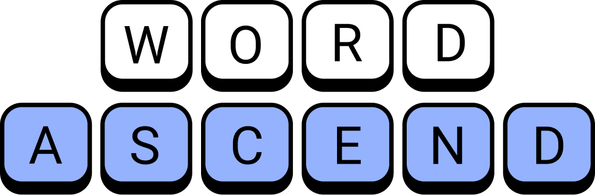

<table >
  <tr>
    <td>
        
    </td>
    <td>
        Create words on a board that constantly moves upwards. A unique combination of word games and endless runner!
    </td>
  </tr>
    <td>
        <a href="/privacy-policy">
            

                
            

        </a>
    </td>
    <td>
        <a href="/privacy-policy">
            

                
            

        </a>
    </td>
</table>

## Description

Tap into your strategic side in this innovative blend of classic word games and endless runners. 
Easy to play, hard to master, Word Ascend is a must-have for lovers of word games, puzzles, unscramble games, and crosswords.
Challenge your vocabulary, train your brain and climb the leaderboards... every move counts!

How to play:

- Drag letters to form words and earn points
- Each turn allows you to play one word
- After each turn, the bottom row is cleared
- Score points to unlock additional rows
- The game ends when there are no more letters on the board

How high can you ascend? Download now and find out! 
